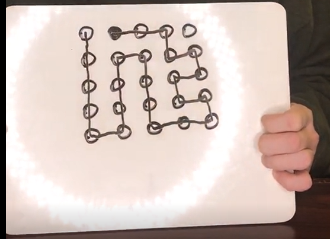
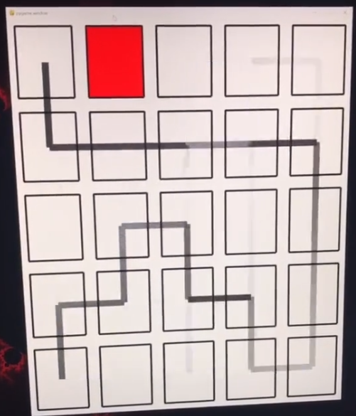
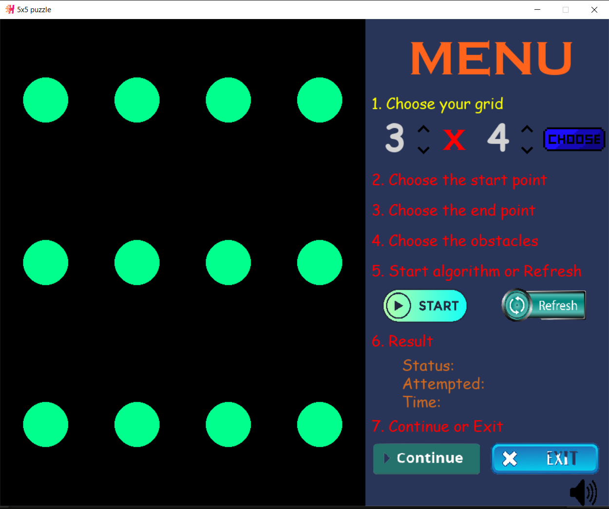
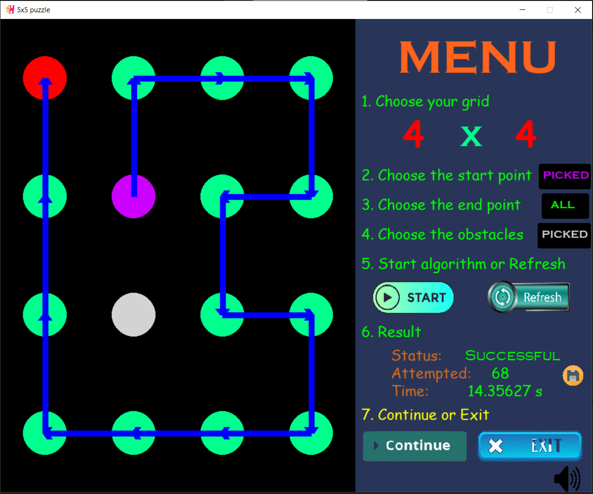

# Hamiltonian Path Finding Visualization

## About the project

### Inspiration
[here]: https://www.tiktok.com/music/Infamous-5x5-puzzle-challenge-6677155524129065734?is_copy_url=1&is_from_webapp=v1.
In this summer 2021, suffering a boring day since COVID-19 pandemic so I can hang out with my friends, and instead of learning get internship as soon as possible I spend a little time for the social media (actually more than 4 hours per day) on Tiktok. Therefore, I have a chance to see a video about the challenge that I immensely impressive which named "Infamous 5x5 puzzle challenge" of "JMatt". You can see this video at [here]


In briefly, the rule of this game is that we are given a grid 5x5 and an end point (black dot) at position (0,1). We can start at any dot in the graph and we have to hit all the dot. In connecting process, we can not do any diagonal line as well as can not repeat dot, or backtrack by crossing the line again or go outside the graph and we have to end at the black dot.



### Ideas
In computer science perspective, it is quite easy to know that is Hamiltonian path finding problem and it is not have any clearly way to to solve this since it's a NP-problem. But with a computer we can solve this by try to draw all cases which means brute-forces. ALthough, this method costs time complexity O(n!), we still can reduce it a little bit by using `Backtracking Algorithm`. 

After that, I continue watching more video about this topics and see this guy using `python` and `pygame modules` to visualize all the process that Backtracking algorithm do. You can see this video 
[here]: https://www.tiktok.com/@its_tilton/video/6975274358059109637?lang=vi-VN&is_copy_url=1&is_from_webapp=v1
. With this idea, I try to use `pygame` to visualize `Hamiltonian path` like that guy and update more advanced features as well as learning a little bit about python GUI.



## Installation

``` sh
git clone https://github.com/nh0znoisung/HamiltonianPathFindingVisualization.git
cd HamiltonianPathFindingVisualization

pip install -r requirements.txt
python main.py
```
or 
``` sh
Download file at https://drive.google.com/file/d/10aRXfoC2h8iyOmNHleVVZTVajpuOGpSk/view?usp=sharing

Run `main.exe`
```





## How to use?
The program will split into 7 steps.

### Step 1
We need to choose the size of grid which is default 3x4 grid. There are up and down arrows to modify the number of rows and columns in this grid and click `choose button` to go to next step. The limit of rows and columns is just from 1 to 100. In reality, in 5x5 problem this will take very long time when we want to proof this problem is no solution.


### Step 2 and 3
In these steps, we need to choose the start point and end point on directed black board. If we choose successfully, the color of green will change from green to `pink` with start point and from green to `red` with end point. Otherwise, if we don't want to choose only one dot, we still have an another option that we can click `All button` which is next to the step line. In this option, the program will iterate through all the available list of nodes not just only one.

Moreover, it is possible that start point and end point are the same. In this case, we call it is a `Hamiltonian circuit`

### Step 4
In grid-graph, sometimes we don't want a perfect grid-graph and need some obstacles between nodes to make more difficult when solving puzzle. So in this step, we can click `Skip button` if we don't need to choose any obstacles. Otherwise, we can totally can click or un-click directly on list of nodes on the board. If we choose the obstacles successfully, the color of nodes will modify from green to `grey`. Finally, we also make sure it points will not coincide with start-point and end-point


### Step 5
Choose `Start button` if we want to start algorithm right now. While choosing `Refresh button`, if we have a mistake in configuration data in set-up process, the program will reset all data and go to `Step 1`.

### Step 6
At first, we will see the status of running process including `Finding`, `No solution`, `Successful`. When the algorithm is running, this menu will display and update the time and how many attempted times that algorithm have run up to now. Until the first solution is found or brute-force all cases but still not found any solution, program will stop this algorithm, it is automatically go straight to `Step 7`. 

### Step 7
If the result is successful, the interface will appear a `save icon` (the round yellow icon next to Successful status line). If we click this one, we take a screenshot the content of the board as .png file and put it on the `Screenshots` folder. The program makes sure that the picture will be unique since each picture is named by the time, date and information that we take this shot.

Furthermore, click `Continue button` if we want to reset all data and go to `Step 1` to solve next problem. Click `Exit button` in order to quit the program now.





## About Mathematics

### Definition

`Hamiltonian Path` - A simple path in a graph G that passes through every vertex exactly once is called a Hamiltonian path. 

`Hamiltonian Circuit` – A simple circuit in a graph G that passes through every vertex exactly once is called a Hamiltonian circuit. 


Unlike Euler paths and circuits, there is `no simple necessary and sufficient criteria` to determine if there are any Hamiltonian paths or circuits in a graph. But there are certain criteria which rule out the existence of a Hamiltonian circuit in a graph, such as- if there is a vertex of degree one in a graph then it is impossible for it to have a Hamiltonian circuit. 
There are certain theorems which give sufficient but not necessary conditions for the existence of Hamiltonian graphs. For example, Ore’s Theorem and Dirac’s Theorem, etc...

Furthermore, there are some rules that we can build the Hamiltonian Path from scratch. Some useful information that you can refer at the link below.

Slide: http://btravers.weebly.com/uploads/6/7/2/9/6729909/11.3_hamiltonian_paths_slides.pdf

Reddit: https://www.reddit.com/r/SBU/comments/74j98u/ams_301_how_to_prove_a_graph_has_no_hamilton/


### Grid graph
But wait a minute, all these theorem above just for general graph. In this problem, we just work on grid-graph which already have some special properties such as the degree of nodes in the corner is 2, nodes on the outline is 3 and nodes inside the grid is 4. And I have found some helpful preferences in order to prove why Hamiltonian path is exist or not in grid-graph. 

Paper: http://www.numdam.org/article/ITA_1994__28_6_567_0.pdf 

Website: https://math.stackexchange.com/questions/1699203/hamilton-paths-cycles-in-grid-graphs


### Notes and preferences

Wikipedia: https://en.wikipedia.org/wiki/Hamiltonian_path

GeeksForGeeks: https://www.geeksforgeeks.org/mathematics-euler-hamiltonian-paths/


## Application

Some challenge is the same with this that I collect it on Tiktok and Google Play:

- https://www.tiktok.com/@widosky/video/6980203953103359258?lang=vi-VN&is_copy_url=1&is_from_webapp=v1
- https://www.tiktok.com/@its_tilton/video/6967896945054518533?lang=vi-VN&is_copy_url=1&is_from_webapp=v1
- https://www.tiktok.com/@elproszenko/video/6968107169971588358
- https://www.tiktok.com/@crazytranslate/video/6977248524974951706?is_copy_url=1&is_from_webapp=v1

- [Flow Free](https://play.google.com/store/apps/details?id=com.bigduckgames.flow&hl=en_US&gl=US)


